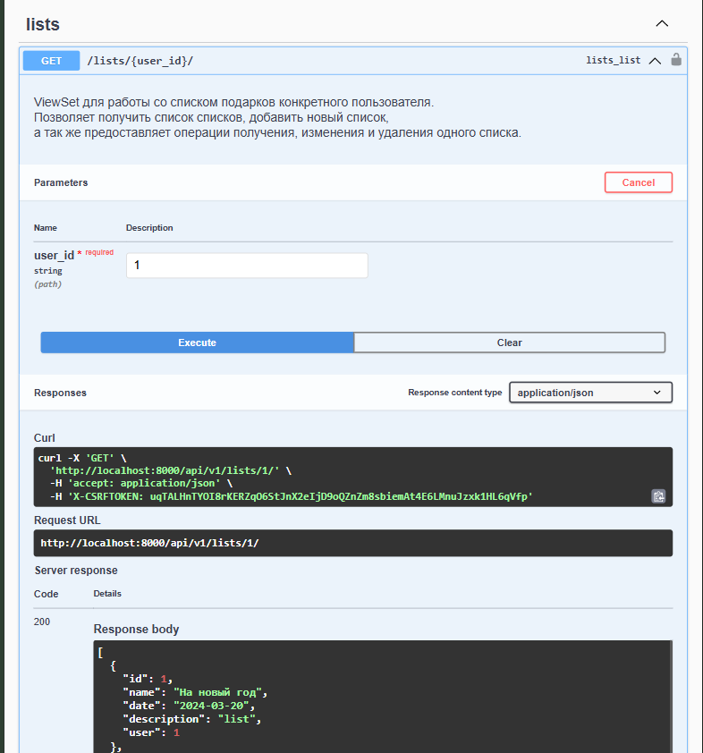

# aith-containers-wishu

Подробнее о системе описано [здесь](server/README.md).

# WISHU Kubernetes Edition

Представленный раннее сервис теперь развёрнут в minikube. 

## How to use

1. Собрать образ сервера:

    ```bash
    docker build -t wishu .
    ```

2. Запустить minikube и прокинуть образ:

    ```bash
    minikube start
    minikube image load wishu
    ```

3. Создать необходимые объекты через cli:

    ```bash
    kubectl apply -f pg_configmap.yml
    kubectl apply -f server_configmap.yml
    kubectl apply -f pg_secret.yml
    kubectl apply -f server_secret.yml

    kubectl apply -f pg_volume.yml
    kubectl apply -f pg_volume_claim.yml
    kubectl apply -f server_volume_claim.yml

    kubectl apply -f pg_service.yml
    kubectl apply -f server_service.yml

    kubectl apply -f pg_deployment.yml
    kubectl apply -f server_deployment.yml
    ```

3. Пробросить для доступа к Swagger:

    ```bash
    kubectl port-forward service/server-service 8000:8000
    ```

    Либо, зная имя пода:

    ```bash
    kubectl get pods
    kubectl port-forward wishu-server-5df57c5869-4l4bm  8000:8000
    ```

После будет Swagger доступен по адресу [http://localhost:8000/api/v1/swagger](http://localhost:8000/api/v1/swagger).

Для проверки работоспособности рекомендуем такой запрос: 

```bash
curl http://localhost:8000/api/v1/lists/1/
```

Или в интерфейсе Swagger:

