# Часть 1. Установка minikube

1. Установлен и запущен Docker Desktop, проверена его работоспособность.

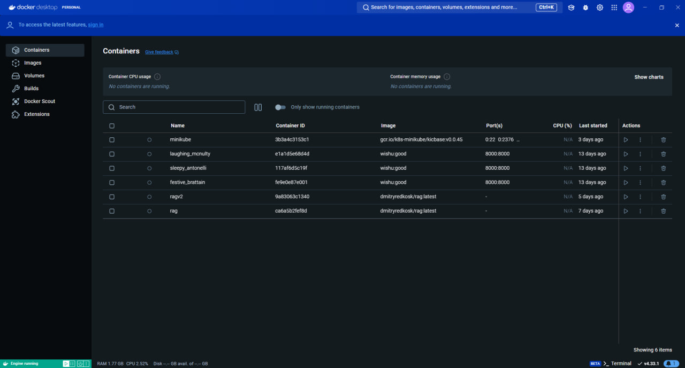

2. Скачан и настроен `kubectl` для работы с `Kubernetes CLI`.

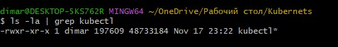

3. Скачан c GitHub и установлен `minikube-installer.exe`.

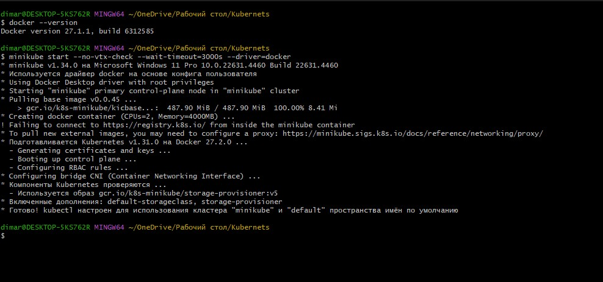

4. Проверили, что все успешно запустилось с помощью команд:
```
docker ps
kubectl config view
```

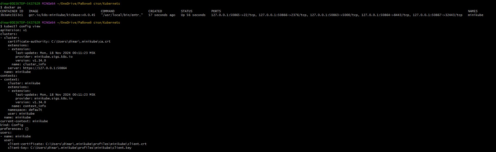

5. Порадовались, что в настоящее время установить и пощупать кубер это довольно несложно и быстро :))))))

# Часть 2. Создаем объекты через CLI

1. Прогнали манифесты, чтоб описанные объекты создались в кластере, с помощью команды:
```
create –f имя_файла
```

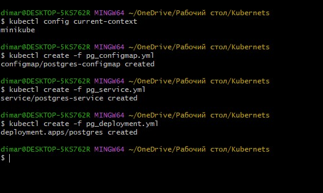

💡**Вопрос: важен ли порядок выполнения этих манифестов? Почему?**

✅ **Ответ**:
```
Да, порядок выполнения важен, так как манифесты могут зависеть друг от друга. Например:
- ConfigMap и Secret должны быть созданы до Deployment, так как последний использует их для настройки переменных окружения.
- Service можно создать в любое время после Deployment, так как он связывает уже существующие поды.
```

2. Проверили, что все ресурсы успешно создались, с помощью команды:
```
kubectl get тип_ресурса
```
Чтобы посмотреть конкретный ресурс, нужно обратиться к нему через:
```
kubectl describe тип_ресурса/имя_ресурса
```

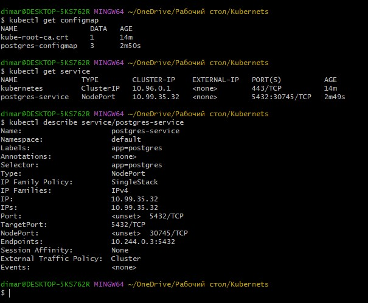

3. Создали `nextcloud.yml` и повторили для него шаги 1 и 2.

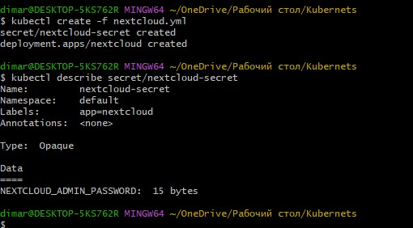

4.  После успешного запуска пода проверили его состояние с помощью команды `kubectl logs имя_пода`

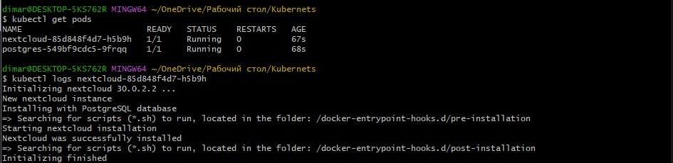

# Часть 3. Подключение извне

1. Для экспонирования объекта типа `Service` для деплоймента использована команда:

```
kubectl expose deployment nextcloud --type=NodePort --port=80
```

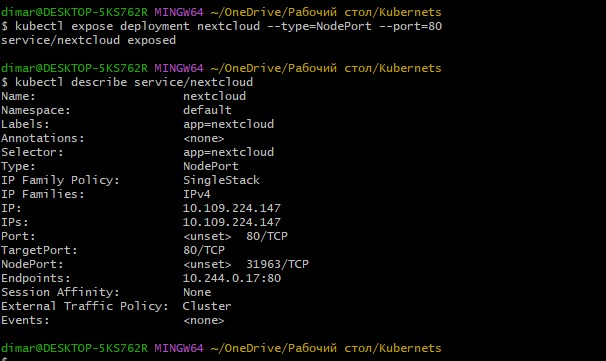

2. Выполнено туннелирование трафика между нодой `Minikube` и сервисом с помощью команды:

```
minikube service nextcloud
```

Команда открыла доступ к интерфейсу `Nextcloud`, захватив терминал до ручного завершения процесса через `Ctrl+C`.

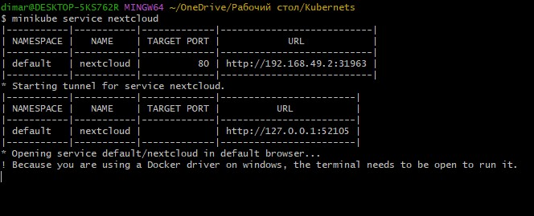

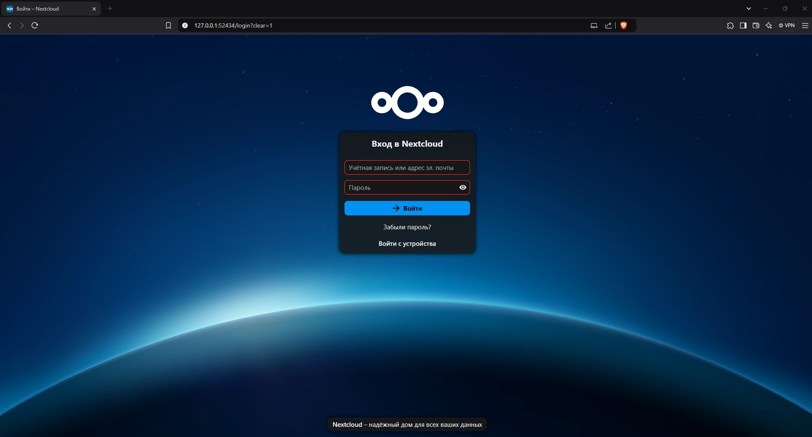

Пройдена авторизация 

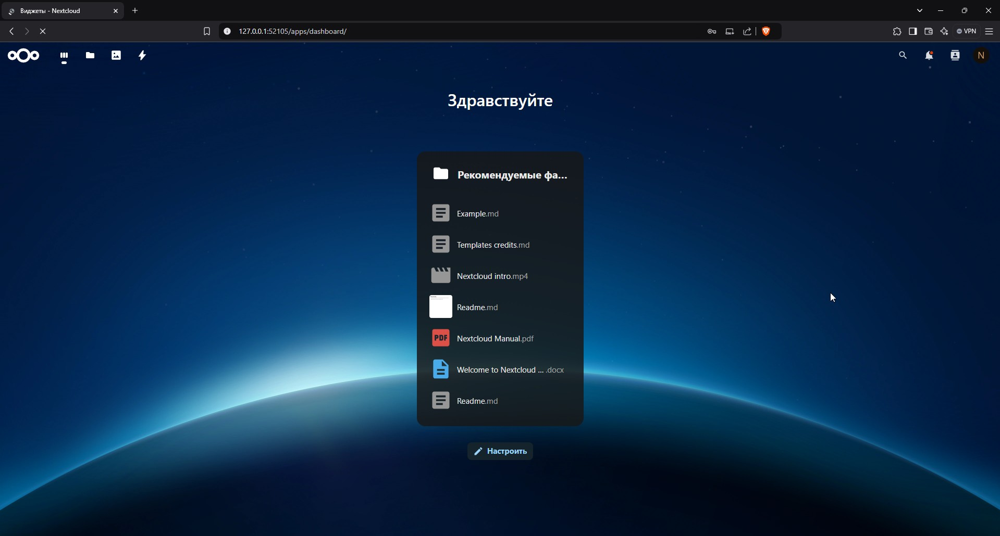

3.  На этом установку полноценного веб-сервиса с нуля считаем успешно завершенной :))))))))))))))

4. Установлен дополнительный компонент Dashboard для Minikube с помощью команды

```
minikube dashboard --url
```

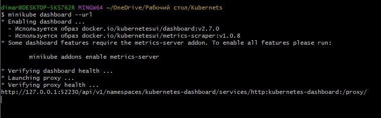

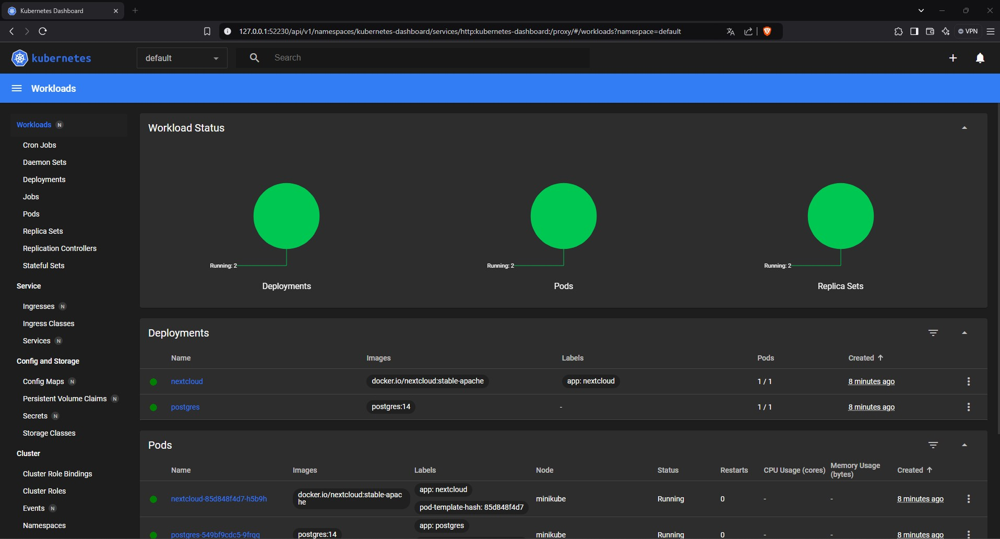

💡**Вопрос:  Что произойдет, если отскейлить количество реплик postgres-deployment в 0, затем обратно в 1, и попробовать снова зайти на Nextcloud?**

✅ **Ответ**:
```
При скейлинге в 0 и затем в 1, все активные поды PostgreSQL удаляются, а затем создаются заново. База данных может быть перезапущена, что приведет к временному недоступности Nextcloud. Однако, данные сохраняются, так как используются Persistent Volumes.
```

# Часть 4. Задание

1. Модифицированы манифесты `PostgreSQL`:

    Переменные `POSTGRES_USER` и `POSTGRES_PASSWORD` перенесены из `ConfigMap` в новый объект типа `Secret`.
    Создан манифест `pg_secret.yml` для хранения секретных данных `PostgreSQL`.

2. Модифицированы манифесты `Nextcloud`:

    Переменные `NEXTCLOUD_UPDATE`, `ALLOW_EMPTY_PASSWORD` и другие перенесены из `Deployment` в новый объект типа `ConfigMap`.
    Создан манифест `nextcloud_configmap.yml` для хранения конфигурационных данных `Nextcloud`.

3. Добавлены `Liveness` и `Readiness` пробы для `Nextcloud`:

    В манифесте `nextcloud_deployment.yml`добавлены `livenessProbe` и `readinessProbe` для мониторинга состояния контейнера.

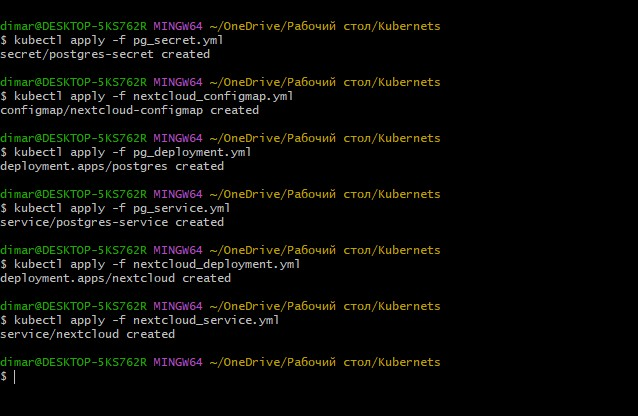

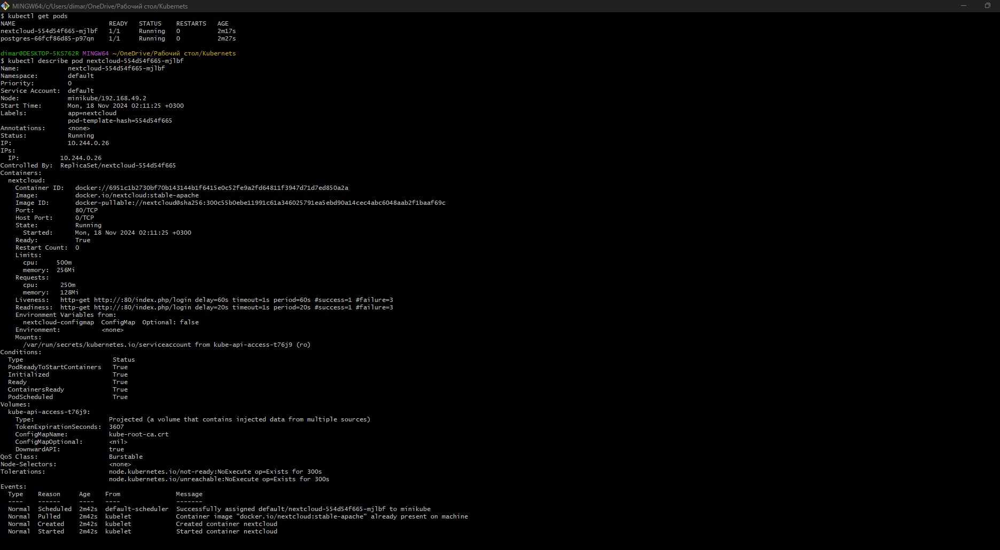